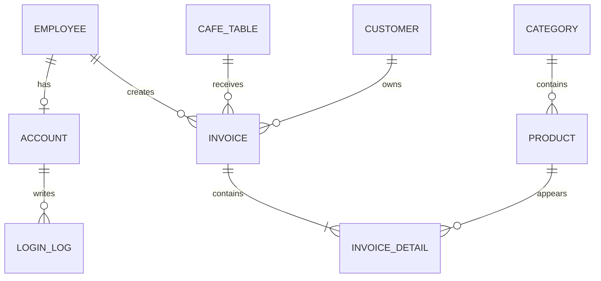

# Thiết kế cơ sở dữ liệu

## Bảng chính

- `Employees`: nhân viên.
- `Accounts`: tài khoản, vai trò, trạng thái khóa.
- `LoginLogs`: lịch sử đăng nhập/đăng xuất.
- `Categories`: danh mục món.
- `Products`: món, giá, hình, trạng thái bán.
- `CafeTables`: bàn và trạng thái.
- `Customers`: khách hàng và điểm.
- `Invoices`: hóa đơn mở/đã thanh toán.
- `InvoiceDetails`: món, số lượng và đơn giá tại thời điểm bán.

Database SQLite được tạo bằng `Database.EnsureCreated()` khi chương trình chạy lần đầu.
